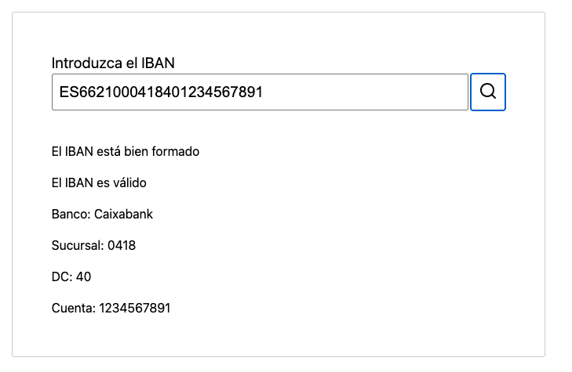
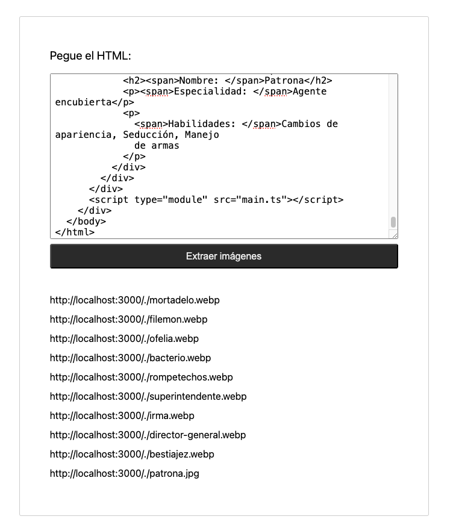
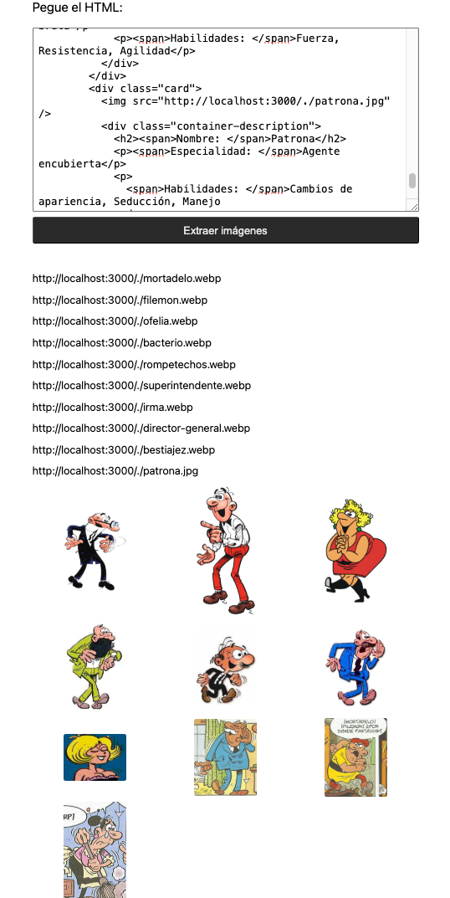

# Modulo 11 - Laboratorio Módulo 11 Ecpresiones regulares

Para poder visualizar el contenido de este laboratorio.

Pasos:

- Clonate el proyecto.
- Instala las dependencias con `npm install`.
- Ejecuta el sandbox con `npm run dev`.
- Abre el navegador en `http://localhost:5173/` (si ese puerto no te funciona, mira en la consola donde has hecho el build, puede que este ocupado y se haya abierto en otro puerto).

_En este módulo presentamos dos prácticas, las cuales se encuentran en la carpeta correspondiente dentro de src: Carpeta apartadoA y Carpeta apartadoB_

# Apartado A. Validar IBAN

Para ver el resultado abre el navegador en `http://localhost:5173/apartadoa.html`

## Interfaz y estilos. HTML y CSS.

Montamos la interfaz donde vamos a introducir los datos. Creamos la estructura en index.html y damos estilos en estilo.css (previamente reseteamos los estilos con el archivo reseteo.css).

## Leer texto introducido en el input

En motor.ts creamos la funcion que lee el contenido del input del formulario.
En main.ts llamamos ha esta función que se ejecuta una vez se ha cargado el DOM.

También en motor incluimos la función que recibe la acción de recibir el valor que añadimos en el campo de texto del formulario. Este valor lo mostramos gracias a la función mostrarInfo (la recogemos en el ui.ts)

## El IBAN está bien formado

Esto lo validamos y mostramos el resultado a través de ui.ts. Aquí indicamos que antes de empezar debemos limpiar el contenido del div, y generamos las funciones que nos permitirán pintar los Párrafos con la info necesaria.

En el archivo validaciones.ts creamos la expresión regular que nos ayuda a verificar si está bien formado el IBAN (`const estaBienFormadoElIBAN`).

## El IBAN es válido

Instalamos la libraría _ibantools_ con `npm install ibantools` ya que es la que usaremos para verificar que el IBAN introducido es válido.
En el archivo validaciones.ts creamos la `const esValidoElIBAN`donde eliminamos todos los espacios y guiones y hacemos la validación por medio de la libreria.

Igual que antes, en el archivo ui.ts indicamos el mensaje a mostrar tanto si el IBAN es válido como si no lo es.

## Extraemos los datos de banco, sucursal, dígito de control y número de cuenta

En el archivo model.ts creamos la interface datosIBAN que contiene cada uno de los parámetros que necesitamos extraer. Nos servirá para tipar las constantes creadas en el archivo validaciones.ts.
Creamos la función que valida y extrae los datos por separado, según la expresión regular que hemos creado antes, y en el ui.ts hacemos que se muestren estos datos.

## Asignamos Banco al IBAN

Creamos un archivo de constantes.ts donde recogemos los codigos y los bancos correspondientes como un array de objetos.
En validaciones.ts creamos una costante para extraer el dato que necesitamos `const obtenerNombreBanco´. Usamos .find para localizar el número y comprobar que hay una coincidencia dentro del array creado anteriormente.

En caso de que ocurra la coincidencia se devuelve `bancoEncontrado`(lo llamamos en la función anterior donde extraemos los datos, para que en lugar de los números nos de el valor del banco correspondiente). y si no nos devuelve "Desconocido".

## Comprobamos que funciona

Buscamos un IBAN válido y lo comprobamos, igual que con uno que no sea real y vemos que funciona correctamente.

# Apartado B. Extraer enlaces

Para ver el resultado abre el navegador en `http://localhost:5173/apartadob.html`

## Interfaz y estilo CSS

Incluimos un apartadob.html con la interfaz y le damos estilo desde los archivos reseteo.css (que usamos también en el anterior apartado) y estilo.css (dentro de la carpeta apartado B).

## Leer texto introducido en el `textarea`

La función que activa el formulario la invocamos una vez se haya cargado el DOM desde main.ts. En motor.ts creamos las funciones que:

- Inicializan el formulario
- Activan el botón _Extraer imágenes_

## Expresión regular

Creamos la expresión regular a través de la que vamos a extraer los datos de las urls en el archivo extraer-img.ts

Después pintaremos los datos extraidos en la interfaz.

## Mostrar datos

Igual que en el ejercicio anterior, en el ui.ts limpiamos el contenedor, y volcamos los datos. Creamos el elemento en el html y creamos los párrafos que contienen la información.

## Comprobamos que funciona

Copiamos y pegamos el html en la interfaz y visualizamos el listado de urls.

## Extra. Mostrar las imágenes en un grid.

Repetimos los mismos pasos que para pintar los enlaces.

1. Añadimos un div en el html, donde después se mostrarán las imagenes.
2. En `ui.ts` creamos las funciones para limpiar el div y que aparezca vacío, pintar las imágenes dentro del div que hemos creado, crear el elemento imagen y mostrar las imagenes pasándole el código HTML del que se extraen los enlaces de las imágenes.
3. En el `motor.ts` añadimos que cuando encuentre las URLS las muestre como texto, pero también que nos muestre las imágenes (llamamos a la función que acabamos de crear)
4. Arrancamos el servidor donde están las imágenes para así poder comprobar que funciona. Y una vez visualizamos las imágenes le damos estilo en la hoja `estilo.css`.

